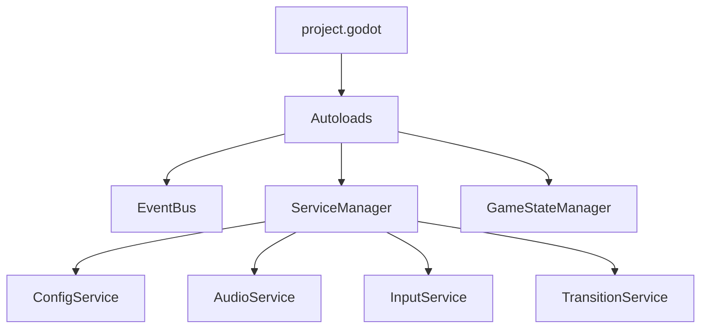
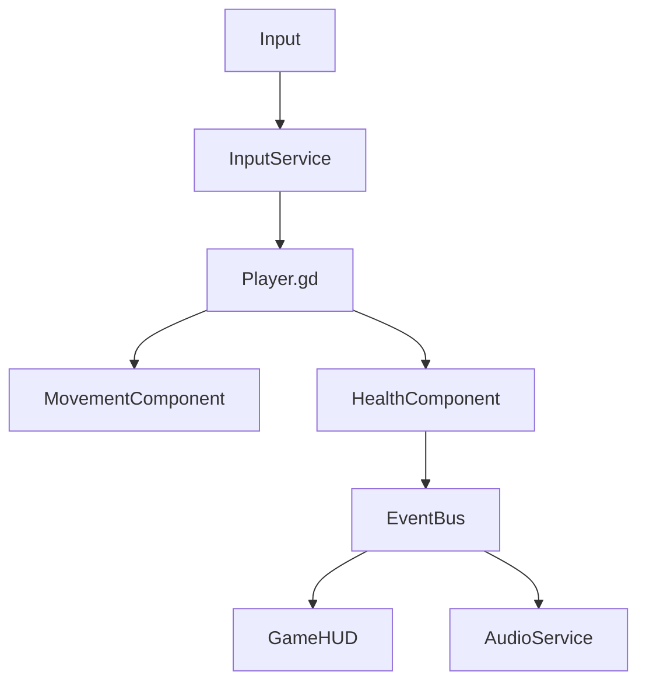
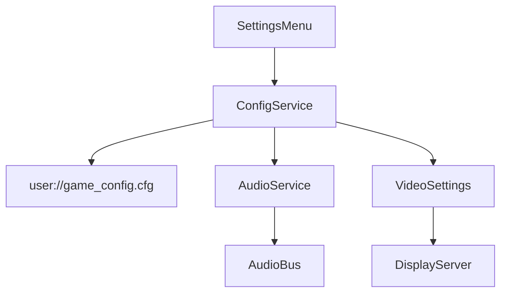

# 📚 Documentación Técnica Completa - RougeLike Base


---

## 1. 📖 Visión General

### Descripción del Proyecto

**RougeLike Base** es un videojuego top-down desarrollado en **Godot 4.4** que implementa una arquitectura modular avanzada y escalable. El proyecto está diseñado como una base sólida para el desarrollo de juegos roguelike, proporcionando sistemas robustos de componentes, servicios centralizados y comunicación por eventos.

### Propósito y Público Objetivo

- **Propósito**: Servir como base técnica para desarrolladores de juegos roguelike que buscan una arquitectura profesional y mantenible
- **Público Objetivo**:
  - Desarrolladores indie experimentados
  - Estudiantes de desarrollo de videojuegos
  - Equipos pequeños que necesitan una base sólida

### Tecnologías Principales

| Tecnología | Versión | Uso |
|------------|---------|-----|
| **Godot Engine** | 4.4+ | Motor principal del juego |
| **GDScript** | Nativo | Lenguaje de programación principal |
| **Git** | 2.0+ | Control de versiones |
| **Linux/Windows/macOS** | Multiplataforma | Plataformas de desarrollo y target |

---

## 2. 🚀 Guía de Instalación y Despliegue

### Requisitos Previos

#### Software Necesario
- **Godot Engine 4.4** o superior ([Descargar](https://godotengine.org/download))
- **Git** para control de versiones
- **Sistema Operativo**: Linux (recomendado), Windows 10+, macOS 10.14+

#### Especificaciones Mínimas del Sistema
- **CPU**: Dual-core 2.0 GHz
- **RAM**: 4 GB
- **GPU**: OpenGL 3.3 compatible
- **Almacenamiento**: 500 MB libres

### Instalación Paso a Paso

#### 1. Clonar el Repositorio
```bash
git clone https://github.com/1SSeba/Proyecto-Z.git
cd topdown-game
```

#### 2. Configurar Godot
```bash
# Verificar instalación de Godot
godot --version

# Importar el proyecto
godot --import project.godot
```

#### 3. Verificar Configuración
```bash
# Ejecutar verificaciones (opcional)
./scripts/check_syntax.sh
```

#### 4. Ejecutar el Proyecto

**Desde Godot Editor:**
1. Abrir Godot Engine
2. Hacer clic en "Import"
3. Seleccionar `project.godot`
4. Presionar `F5` para ejecutar

**Desde Terminal:**
```bash
godot --resolution 1280x720
```

### Configuración para Entornos

#### Desarrollo Local
```bash
# Configurar autoloads de debug
export GODOT_DEBUG=true

# Habilitar logs detallados
export GODOT_VERBOSE=true
```

#### Producción
```bash
# Exportar build optimizado
godot --headless --export-debug "Linux/X11" builds/debug/game_debug

# Build de release
godot --headless --export-release "Linux/X11" builds/release/game_release
```

### Solución de Problemas de Instalación

| Problema | Solución |
|----------|----------|
| **Godot no detecta el proyecto** | Verificar que `project.godot` existe y es válido |
| **Errores de autoload** | Revisar rutas en Project Settings > Autoload |
| **Assets faltantes** | Ejecutar `File > Reimport` en Godot |
| **Scripts con errores** | Usar `./scripts/check_syntax.sh` |

---

## 3. 🏗️ Estructura del Proyecto

### Árbol de Directorios Comentado

```
topdown-game/                          # Raíz del proyecto
├── 📄 project.godot                    # Configuración principal de Godot
├── 📄 README.md                        # Documentación del usuario
├── 📄 CHANGELOG.md                     # Historia de cambios
├── 📄 LICENSE                          # Licencia MIT
├── 📄 DOCUMENTATION.md                 # Esta documentación
│
├── 🔧 config/                          # Configuraciones del proyecto
│   ├── default_bus_layout.tres        # Layout de audio buses
│   └── export_presets.cfg              # Presets de exportación
│
├── 📚 docs/                            # Documentación adicional
│   ├── QUICK_REFERENCE.md              # Referencia rápida
│   ├── SCRIPT_DOCUMENTATION.md         # Docs de scripts
│   ├── USAGE_GUIDE.md                  # Guía de uso
│   └── user-guides/                    # Guías específicas
│       ├── installation.md             # Guía de instalación
│       └── settings-menu.md            # Documentación del menú
│
├── 🏗️ builds/                          # Builds del juego
│   ├── README.md                       # Info sobre builds
│   └── debug/                          # Builds de debug
│
├── 🎮 game/                            # Código principal del juego
│   │
│   ├── 🏗️ core/                        # Arquitectura base del sistema
│   │   ├── ServiceManager.gd           # Gestor central de servicios
│   │   ├── ResourceLoader.gd           # Cargador de recursos .res
│   │   │
│   │   ├── 🧩 components/               # Sistema de componentes
│   │   │   ├── Component.gd            # Clase base de componentes
│   │   │   ├── HealthComponent.gd      # Gestión de vida/daño
│   │   │   ├── MenuComponent.gd        # Lógica de menús
│   │   │   └── MovementComponent.gd    # Control de movimiento
│   │   │
│   │   ├── 📡 events/                   # Sistema de eventos
│   │   │   └── EventBus.gd             # Bus global de eventos
│   │   │
│   │   ├── ⚙️ services/                 # Servicios globales
│   │   │   ├── BaseService.gd          # Clase base de servicios
│   │   │   ├── ConfigService.gd        # Gestión de configuración
│   │   │   ├── AudioService.gd         # Control de audio
│   │   │   ├── InputService.gd         # Gestión de input
│   │   │   ├── ResourceLibrary.gd      # Biblioteca de recursos
│   │   │   └── ResourceManager.gd      # Gestor de recursos
│   │   │
│   │   └── 🔄 systems/                  # Sistemas del juego
│   │       ├── README.md               # Info de sistemas
│   │       └── game-state/             # Gestión de estados
│   │           ├── GameStateManager.gd # Control de estados del juego
│   │           └── StateMachine/       # Máquina de estados
│   │
│   ├── 🎭 entities/                     # Entidades del juego
│   │   └── characters/                 # Personajes
│   │       ├── Player.gd               # Lógica del jugador
│   │       └── Player.tscn             # Escena del jugador
│   │
│   ├── 🎬 scenes/                       # Escenas principales
│   │   ├── environments/               # Entornos de juego
│   │   │   └── Room/                   # Habitaciones
│   │   │       └── Room.tscn           # Escena de habitación
│   │   ├── gameplay/                   # Escenas de gameplay
│   │   │   ├── Lobby.tscn              # Lobby del juego
│   │   │   └── Main.tscn               # Escena principal
│   │   ├── hud/                        # Interfaces de juego
│   │   │   ├── GameHUD.gd              # Lógica del HUD
│   │   │   └── GameHUD.tscn            # Escena del HUD
│   │   └── menus/                      # Menús del juego
│   │       ├── MainMenu.gd             # Lógica menú principal
│   │       ├── MainMenu.tscn           # Escena menú principal
│   │       ├── SettingsMenu.gd         # Lógica de configuraciones
│   │       └── SettingsMenu.tscn       # Escena de configuraciones
│   │
│   ├── 🎨 assets/                       # Recursos del juego
│   │   ├── README_RESOURCES.md         # Documentación de recursos
│   │   ├── *.res                       # Archivos de recursos compilados
│   │   ├── audio/                      # Assets de audio
│   │   ├── characters/                 # Sprites de personajes
│   │   │   └── Player/                 # Assets del jugador
│   │   │       ├── Attack1/            # Animaciones de ataque 1
│   │   │       ├── Attack2/            # Animaciones de ataque 2
│   │   │       ├── Idle/               # Animaciones idle
│   │   │       └── Run/                # Animaciones de correr
│   │   ├── Maps/                       # Mapas y tiles
│   │   ├── materials/                  # Materiales 3D
│   │   ├── shaders/                    # Shaders personalizados
│   │   │   └── MenuBackground.gdshader # Shader de fondo de menú
│   │   └── textures/                   # Texturas generales
│   │
│   └── 🖥️ ui/                           # Interfaces de usuario
│       ├── components/                 # Componentes de UI
│       │   ├── BackgroundManager.gd    # Gestión de fondos
│       │   └── TransitionManager.gd    # Transiciones de UI
│       └── themes/                     # Temas visuales
│           └── hud_theme.tres          # Tema del HUD
│
└── 🛠️ scripts/                          # Herramientas de desarrollo
    ├── check_syntax.sh                 # Verificar sintaxis
    ├── clean_project.sh                # Limpiar archivos temp
    └── quick_export.sh                 # Exportación rápida
```

### Explicación de Carpetas Clave

#### `/game/core/` - Arquitectura Base
Contiene toda la lógica fundamental del sistema:
- **Componentes**: Sistema modular de funcionalidades
- **Servicios**: Funcionalidades globales (audio, input, config)
- **Eventos**: Comunicación desacoplada entre sistemas
- **Estados**: Control del flujo del juego

#### `/game/entities/` - Entidades del Juego
Objetos principales del juego como el jugador, enemigos, items, etc.

#### `/game/scenes/` - Escenas Principales
Escenas organizadas por funcionalidad: gameplay, menús, HUD, entornos.

#### `/game/assets/` - Recursos Optimizados
Assets organizados con sistema de recursos `.res` para mejor rendimiento.

---

## 4. 🎮 Uso

### Controles del Juego

#### Controles Básicos
| Acción | Teclado | Alternativo | Descripción |
|--------|---------|-------------|-------------|
| **Mover Arriba** | `W` | `↑` | Movimiento hacia arriba |
| **Mover Abajo** | `S` | `↓` | Movimiento hacia abajo |
| **Mover Izquierda** | `A` | `←` | Movimiento hacia la izquierda |
| **Mover Derecha** | `D` | `→` | Movimiento hacia la derecha |
| **Interactuar** | `E` | `Espacio` | Interactuar con objetos |
| **Cancelar/Menú** | `Escape` | - | Abrir menú/cancelar |

#### Controles de Debug (Solo Desarrollo)
| Acción | Tecla | Función |
|--------|-------|---------|
| **Debug Damage** | `Enter` | Aplicar 10 de daño al jugador |
| **Debug Heal** | `F2` | Curar 20 de vida al jugador |
| **Debug Kill** | `F3` | Matar al jugador instantáneamente |

### Navegación por Menús

#### Menú Principal
```
MainMenu.tscn
├── [Comenzar Juego] → Main.tscn
├── [Configuraciones] → SettingsMenu.tscn
└── [Salir] → Cerrar aplicación
```

#### Menú de Configuraciones
```
SettingsMenu.tscn
├── Pestaña Audio
│   ├── Volumen Principal (0-100%)
│   ├── Volumen Música (0-100%)
│   ├── Volumen Efectos (0-100%)
│   └── Audio Espacial (On/Off)
├── Pestaña Video
│   ├── VSync (On/Off)
│   ├── Límite FPS
│   ├── Resolución
│   ├── Modo Ventana
│   └── Preset de Calidad
├── Pestaña Controles
│   ├── Sensibilidad Mouse
│   ├── Invertir Mouse X
│   └── Vibración Gamepad
└── Botones de Acción
    ├── [Aplicar] → Guardar cambios
    ├── [Aceptar] → Aplicar y salir
    └── [Cancelar] → Descartar cambios
```

### Casos de Uso Típicos

#### 1. Desarrollador: Agregar Nueva Funcionalidad
```gdscript
# Crear un nuevo componente
extends Component
class_name MiNuevoComponente

func _initialize():
    component_id = "MiNuevoComponente"
    # Lógica de inicialización

# Usar el componente
extends CharacterBody2D

func _ready():
    var mi_componente = MiNuevoComponente.new()
    add_child(mi_componente)
```

#### 2. Desarrollador: Usar Sistema de Eventos
```gdscript
# Emitir evento personalizado
EventBus.emit_event("mi_evento_custom", {"data": "mi_data"})

# Escuchar eventos existentes
EventBus.player_died.connect(_on_player_died)
EventBus.audio_play_sfx.connect(_on_sfx_request)

func _on_player_died():
    print("¡El jugador ha muerto!")
```

#### 3. Desarrollador: Acceder a Servicios
```gdscript
# Obtener servicio de configuración
var config_service = ServiceManager.get_config_service()
var master_volume = config_service.get_setting("audio", "master_volume", 1.0)

# Verificar servicios disponibles
if ServiceManager.are_services_ready():
    var audio_service = ServiceManager.get_audio_service()
    # Usar servicio de audio
```

#### 4. Jugador: Sesión de Juego Típica
1. **Inicio**: Ejecutar juego → Menú Principal
2. **Configuración**: [Configuraciones] → Ajustar audio/video → [Aplicar]
3. **Juego**: [Comenzar Juego] → Controlar personaje con WASD
4. **Pausa**: `Escape` → Menú de pausa
5. **Finalizar**: Regresar al menú principal o salir

---

## 5. 🏛️ Arquitectura Interna

### Patrones de Diseño Implementados

#### 1. Patrón Singleton (ServiceManager)
```gdscript
# ServiceManager actúa como punto central de acceso a servicios
extends Node

var services: Dictionary = {}

func get_service(service_name: String) -> Node:
    return services.get(service_name, null)
```

#### 2. Patrón Observer (EventBus)
```gdscript
# Sistema de eventos desacoplado
extends Node

signal audio_play_sfx(sfx_name: String, volume: float)
signal player_died()

# Los sistemas se suscriben sin conocer emisores
EventBus.player_died.connect(_on_player_died)
```

#### 3. Patrón Component (Sistema de Componentes)
```gdscript
# Composición sobre herencia
extends Component
class_name HealthComponent

# Funcionalidad específica encapsulada
func take_damage(amount: int):
    current_health -= amount
    health_changed.emit(current_health, max_health)
```

#### 4. Patrón State Machine (GameStateManager)
```gdscript
enum GameState {
    MAIN_MENU, LOADING, PLAYING, PAUSED, GAME_OVER, SETTINGS
}

func change_state(new_state: GameState):
    # Transiciones controladas entre estados
```

### Módulos y Clases Importantes

#### ServiceManager.gd
**Propósito**: Gestor central de todos los servicios del juego.

**Funcionalidades Clave**:
- Inicialización secuencial de servicios
- Acceso thread-safe a servicios
- Gestión del ciclo de vida de servicios
- Verificación de dependencias

```gdscript
# Ejemplo de uso
var audio_service = ServiceManager.get_audio_service()
if ServiceManager.is_service_ready("AudioService"):
    audio_service.play_sfx("jump_sound")
```

#### EventBus.gd
**Propósito**: Sistema de comunicación global por eventos.

**Funcionalidades Clave**:
- Eventos predefinidos para sistemas comunes
- Historial de eventos para debugging
- Métodos de conveniencia para eventos comunes
- Desacoplamiento total entre emisores y receptores

```gdscript
# Eventos disponibles
signal audio_play_sfx(sfx_name: String, volume: float)
signal room_entered(room_id: String)
signal enemy_defeated(enemy: Node)
signal item_collected(item_name: String, quantity: int)
```

#### Component.gd (Clase Base)
**Propósito**: Clase base para todos los componentes del sistema.

**Funcionalidades Clave**:
- Inicialización automática y manual
- Sistema de dependencias entre componentes
- Habilitación/deshabilitación dinámica
- Acceso fácil a otros componentes

```gdscript
# Crear componente personalizado
extends Component
class_name AttackComponent

func _initialize():
    component_id = "AttackComponent"
    add_dependency(get_component("HealthComponent"))
```

#### Player.gd
**Propósito**: Lógica principal del personaje jugador.

**Funcionalidades Clave**:
- Sistema de movimiento fluido con aceleración/fricción
- Animaciones direccionales automáticas
- Sistema de salud integrado
- Controles de debug para desarrollo
- Integración con servicios globales

```gdscript
# Características destacadas
@export var speed: float = 150.0
@export var acceleration: float = 1000.0
@export var friction: float = 1000.0

# Sistema de salud
signal health_changed(current: float, max_health: float)
signal died()
```

### Flujo de Datos Principal

#### 1. Inicialización del Sistema


#### 2. Flujo de Gameplay


#### 3. Flujo de Configuración


### Dependencias Externas

#### Dependencias de Godot
- **Godot Engine 4.4**: Motor base
- **GDScript**: Lenguaje principal
- **Godot Audio System**: Sistema de audio
- **Godot Input System**: Sistema de input
- **Godot Scene System**: Gestión de escenas

#### Recursos del Proyecto
- **ConfigFile**: Persistencia de configuraciones
- **Resource**: Sistema de recursos .res
- **PackedScene**: Escenas precargadas
- **Texture2D**: Texturas y sprites

#### Archivos de Configuración
- `project.godot`: Configuración principal
- `export_presets.cfg`: Configuración de exportación
- `default_bus_layout.tres`: Layout de audio buses
- `user://game_config.cfg`: Configuraciones del usuario

### Interacción entre Sistemas

#### Diagrama de Comunicación
```
┌─────────────────┐    ┌─────────────────┐    ┌─────────────────┐
│   Player.gd     │    │   EventBus.gd   │    │  GameHUD.gd     │
│                 │    │                 │    │                 │
│ health_changed ──────► player_health ───────► update_health   │
│ take_damage()   │    │                 │    │                 │
└─────────────────┘    └─────────────────┘    └─────────────────┘
         │                       │                       │
         │                       │                       │
         ▼                       ▼                       ▼
┌─────────────────┐    ┌─────────────────┐    ┌─────────────────┐
│ AudioService    │    │ ConfigService   │    │ GameStateManager│
│                 │    │                 │    │                 │
│ play_sfx()      │    │ save_setting()  │    │ change_state()  │
└─────────────────┘    └─────────────────┘    └─────────────────┘
```

---

## 6. 🤝 Contribución y Buenas Prácticas

### Estándares de Código

#### Nomenclatura
```gdscript
# Clases: PascalCase
class_name PlayerController

# Variables y funciones: snake_case
var player_health: int = 100
func calculate_damage() -> int:

# Constantes: UPPER_SNAKE_CASE
const MAX_HEALTH: int = 100

# Señales: snake_case con prefijo descriptivo
signal health_changed(current: int, max_health: int)
signal player_died()

# Nodos @onready: snake_case
@onready var health_bar: ProgressBar = $HealthBar
```

#### Estructura de Archivos
```gdscript
extends [BaseClass]
class_name [ClassName]

# 1. Señales
signal my_signal(param: Type)

# 2. Exports
@export var my_variable: int = 10

# 3. Variables públicas
var public_variable: String = ""

# 4. Variables privadas
var _private_variable: bool = false

# 5. @onready variables
@onready var my_node: Node = $MyNode

# 6. Métodos virtuales (_ready, _process, etc.)
func _ready():
    pass

# 7. Métodos públicos
func public_method():
    pass

# 8. Métodos privados
func _private_method():
    pass
```

#### Documentación de Código
```gdscript
## Componente que maneja la salud de una entidad
##
## HealthComponent proporciona funcionalidades de salud, daño y curación.
## Se integra automáticamente con el EventBus para notificar cambios.
##
## @tutorial: https://docs.proyecto.com/health-component
extends Component
class_name HealthComponent

## Emitido cuando la salud cambia
## @param current: Salud actual
## @param maximum: Salud máxima
signal health_changed(current: int, maximum: int)

## Salud máxima de la entidad
@export var max_health: int = 100: set = set_max_health

## Aplica daño a la entidad
## @param amount: Cantidad de daño a aplicar
## @param source: Fuente del daño (opcional)
## @return: true si el daño fue aplicado, false si fue bloqueado
func take_damage(amount: int, source: Node = null) -> bool:
    # Implementación...
```

### Flujo de Contribución

#### 1. Setup de Desarrollo
```bash
# Fork del repositorio
git clone https://github.com/tu-usuario/Proyecto-Z.git
cd topdown-game

# Crear rama para feature
git checkout -b feature/mi-nueva-feature

# Configurar hooks de pre-commit
cp scripts/pre-commit.sh .git/hooks/pre-commit
chmod +x .git/hooks/pre-commit
```

#### 2. Desarrollo
```bash
# Verificar código antes de commit
./scripts/check_syntax.sh

# Ejecutar tests
./scripts/run_tests.sh

# Verificar estilo de código
./scripts/check_style.sh
```

#### 3. Testing
```gdscript
# Ejemplo de test básico
extends GutTest

func test_health_component_take_damage():
    var health_comp = HealthComponent.new()
    health_comp.max_health = 100
    health_comp.current_health = 100

    var damage_applied = health_comp.take_damage(25)

    assert_true(damage_applied)
    assert_eq(health_comp.current_health, 75)
```

#### 4. Pull Request
- **Título claro**: `feat: Agregar sistema de inventario básico`
- **Descripción detallada** con contexto y cambios
- **Tests incluidos** para nueva funcionalidad
- **Documentación actualizada** si es necesario

### Convenciones de Commits

#### Tipos de Commits
```bash
feat: nueva funcionalidad
fix: corrección de bug
docs: cambios en documentación
style: formateo de código (sin cambios lógicos)
refactor: refactorización de código
test: agregar o modificar tests
chore: tareas de mantenimiento
```

#### Ejemplos
```bash
git commit -m "feat: agregar InventoryComponent con sistema de slots"
git commit -m "fix: corregir memory leak en AudioService"
git commit -m "docs: actualizar documentación de ServiceManager"
git commit -m "refactor: simplificar lógica de movimiento en Player"
```

### Arquitectura de Contribuciones

#### Áreas de Contribución

| Área | Nivel | Descripción |
|------|-------|-------------|
| **Core Systems** | Avanzado | Cambios requieren review extenso y tests |
| **Components** | Intermedio | Nuevos componentes welcome con docs |
| **Entities** | Intermedio | Nuevas entidades y mecánicas |
| **UI/UX** | Básico | Mejoras de interfaz y experiencia |
| **Assets** | Básico | Nuevos sprites, sonidos, etc. |
| **Documentation** | Básico | Siempre bienvenida |

#### Proceso de Review

1. **Automated Checks**: CI verifica sintaxis y estilo
2. **Peer Review**: Al menos 1 revisor para cambios menores
3. **Architecture Review**: Lead dev para cambios en core
4. **Testing**: Todos los tests deben pasar
5. **Documentation**: Docs actualizadas según necesidad

### Herramientas de Desarrollo

#### Scripts Disponibles
```bash
# Verificar sintaxis de todos los scripts
./scripts/check_syntax.sh

# Limpiar archivos temporales
./scripts/clean_project.sh

# Exportación rápida para testing
./scripts/quick_export.sh

# Ejecutar en modo desarrollo
./scripts/dev.sh
```

#### Tasks de VS Code (si usas VS Code)
- `Quick Export Debug`: Exportar build de debug
- `Run Game - Graphic Mode`: Ejecutar con interfaz gráfica
- `Test Game - Simple Settings`: Prueba rápida

---

## 7. ❓ FAQ y Solución de Problemas

### Preguntas Frecuentes

#### ¿Cómo agregar un nuevo componente?
```gdscript
# 1. Crear archivo en game/core/components/
extends Component
class_name MiComponente

func _initialize():
    component_id = "MiComponente"
    # Tu lógica aquí

# 2. Usar en una entidad
extends CharacterBody2D

func _ready():
    var mi_comp = MiComponente.new()
    add_child(mi_comp)
```

#### ¿Cómo agregar un nuevo servicio?
```gdscript
# 1. Crear archivo en game/core/services/
extends BaseService
class_name MiServicio

func start_service():
    service_name = "MiServicio"
    # Lógica de inicialización

# 2. Registrar en ServiceManager.gd
func _create_service(service_name: String) -> Node:
    match service_name:
        "MiServicio":
            return MiServicio.new()
```

#### ¿Cómo persistir configuraciones?
```gdscript
# Usar ConfigService
var config_service = ServiceManager.get_config_service()

# Guardar configuración
config_service.set_setting("mi_categoria", "mi_clave", "mi_valor")

# Cargar configuración
var valor = config_service.get_setting("mi_categoria", "mi_clave", "valor_default")
```

#### ¿Cómo agregar nuevos eventos?
```gdscript
# 1. Agregar señal en EventBus.gd
signal mi_evento_personalizado(data: Dictionary)

# 2. Emitir el evento
EventBus.mi_evento_personalizado.emit({"info": "mi_data"})

# 3. Escuchar el evento
EventBus.mi_evento_personalizado.connect(_on_mi_evento)
```

### Problemas Comunes

#### Error: "ServiceManager no está listo"
**Causa**: Acceso a servicios antes de la inicialización completa.

**Solución**:
```gdscript
func _ready():
    await _wait_for_services()
    # Usar servicios aquí

func _wait_for_services():
    while not ServiceManager.are_services_ready():
        await get_tree().process_frame
```

#### Error: "Component no se inicializa"
**Causa**: Dependencias circulares o falta de inicialización.

**Solución**:
```gdscript
# Asegurar inicialización manual si es necesario
func _ready():
    if not component.is_component_ready:
        await component.initialize_component()
```

#### Error: "EventBus señal no existe"
**Causa**: Referencia a señal inexistente o mal nombrada.

**Solución**:
```gdscript
# Verificar que la señal existe
if EventBus.has_signal("mi_signal"):
    EventBus.mi_signal.connect(_on_mi_signal)
```

#### Performance: "Muchos objects en memoria"
**Causa**: Referencias no limpiadas o cycles de memoria.

**Solución**:
```gdscript
# Limpiar referencias en _exit_tree
func _exit_tree():
    if EventBus.my_signal.is_connected(_on_my_signal):
        EventBus.my_signal.disconnect(_on_my_signal)
```

#### Error: "Scene cannot be loaded"
**Causa**: Ruta incorrecta o escena corrupta.

**Solución**:
```gdscript
# Verificar existencia antes de cargar
if ResourceLoader.exists("res://mi/escena.tscn"):
    var scene = load("res://mi/escena.tscn")
```

#### Build Error: "Export template missing"
**Causa**: Templates de exportación no instalados.

**Solución**:
```bash
# Descargar templates desde Godot Editor
Project > Export > Manage Export Templates > Download and Install
```

### Debugging y Profiling

#### Habilitar Debug Verbose
```gdscript
# En project.godot o por código
OS.set_environment("GODOT_VERBOSE", "1")
```

#### Profiling de Performance
```gdscript
# Usar Godot's profiler
func _ready():
    # Habilitar profiler
    get_tree().set_debug_collisions_hint(true)
    get_tree().set_debug_navigation_hint(true)
```

#### Debug de Servicios
```gdscript
# Imprimir estado de servicios
func _input(event):
    if event.is_action_pressed("ui_home"):  # F1 por ejemplo
        ServiceManager.print_services_status()
```

#### Debug de Componentes
```gdscript
# En cualquier entidad con componentes
func debug_components():
    for child in get_children():
        if child is Component:
            print("Component: %s, Ready: %s" % [child.component_id, child.is_component_ready])
```

---

## 8. 📄 Licencia y Créditos

### Licencia

Este proyecto está licenciado bajo la **Licencia MIT**.

```
MIT License

Copyright (c) 2025 [Tu Nombre]

Permission is hereby granted, free of charge, to any person obtaining a copy
of this software and associated documentation files (the "Software"), to deal
in the Software without restriction, including without limitation the rights
to use, copy, modify, merge, publish, distribute, sublicense, and/or sell
copies of the Software, and to permit persons to whom the Software is
furnished to do so, subject to the following conditions:

The above copyright notice and this permission notice shall be included in all
copies or substantial portions of the Software.

THE SOFTWARE IS PROVIDED "AS IS", WITHOUT WARRANTY OF ANY KIND, EXPRESS OR
IMPLIED, INCLUDING BUT NOT LIMITED TO THE WARRANTIES OF MERCHANTABILITY,
FITNESS FOR A PARTICULAR PURPOSE AND NONINFRINGEMENT. IN NO EVENT SHALL THE
AUTHORS OR COPYRIGHT HOLDERS BE LIABLE FOR ANY CLAIM, DAMAGES OR OTHER
LIABILITY, WHETHER IN AN ACTION OF CONTRACT, TORT OR OTHERWISE, ARISING FROM,
OUT OF OR IN CONNECTION WITH THE SOFTWARE OR THE USE OR OTHER DEALINGS IN THE
SOFTWARE.
```

#### Qué Significa la Licencia MIT

✅ **Permitido**:
- Uso comercial
- Modificación
- Distribución
- Uso privado

❌ **No Incluido**:
- Garantía
- Responsabilidad del autor

📋 **Requerido**:
- Incluir aviso de copyright
- Incluir texto de licencia

### Créditos y Agradecimientos

#### Equipo Principal
- **[1SSeba](https://github.com/1SSeba)**: Arquitectura principal, desarrollo core
- **Contribuidores**: Ver [GitHub Contributors](https://github.com/1SSeba/Proyecto-Z/graphs/contributors)

#### Tecnologías Utilizadas
- **[Godot Engine](https://godotengine.org)**: Motor de juego gratuito y open source
- **[GDScript](https://docs.godotengine.org/en/stable/tutorials/scripting/gdscript/index.html)**: Lenguaje de scripting optimizado para Godot

#### Assets y Recursos
- **Sprites de Personajes**: [Asset source si aplica]
- **Texturas de Mapas**: [Asset source si aplica]
- **Audio**: [Asset source si aplica]

#### Inspiración y Referencias
- **Component Systems**: Inspirado en Entity Component System (ECS)
- **Service Architecture**: Basado en Dependency Injection patterns
- **Event-driven**: Inspirado en Observer pattern y Event Bus architectures

#### Comunidad y Soporte
- **Godot Community**: Por el excelente motor y documentación
- **GitHub**: Por la plataforma de desarrollo colaborativo
- **MIT License**: Por proporcionar una licencia flexible y permisiva

### Contribuciones de la Comunidad

Si has contribuido al proyecto, tu nombre aparecerá aquí. Para contribuir:

1. **Fork** el repositorio
2. **Crea** una rama para tu feature
3. **Commit** tus cambios
4. **Envía** un Pull Request

### Contacto y Soporte

#### Repositorio Principal
- **GitHub**: [https://github.com/1SSeba/Proyecto-Z](https://github.com/1SSeba/Proyecto-Z)
- **Issues**: [Reportar bugs](https://github.com/1SSeba/Proyecto-Z/issues)
- **Discussions**: [Discusiones](https://github.com/1SSeba/Proyecto-Z/discussions)

#### Documentación
- **Docs**: Este archivo y `/docs/` directory
- **Wiki**: [GitHub Wiki](https://github.com/1SSeba/Proyecto-Z/wiki) (si está disponible)
- **API Reference**: Generada automáticamente desde comentarios de código

#### Redes Sociales y Comunidad
- **Discord**: [Servidor del proyecto] (si existe)
- **Reddit**: [r/gamedev](https://reddit.com/r/gamedev) para discusiones generales
- **Godot Discord**: [Godot Community Discord](https://discord.gg/godot)

---

## 📈 Estadísticas del Proyecto

### Métricas de Código

| Métrica | Valor |
|---------|-------|
| **Líneas de Código** | ~2,500+ |
| **Archivos .gd** | 15+ |
| **Archivos .tscn** | 8+ |
| **Componentes** | 4 |
| **Servicios** | 4 |
| **Estados del Juego** | 6 |

### Arquitectura Overview

| Sistema | Estado | Descripción |
|---------|--------|-------------|
| **ServiceManager** | ✅ Completo | Gestión centralizada de servicios |
| **EventBus** | ✅ Completo | Sistema de eventos global |
| **Component System** | ✅ Funcional | Sistema de componentes base |
| **Player Controller** | ✅ Completo | Control de personaje con animaciones |
| **Settings Menu** | ✅ Completo | Menú de configuraciones persistentes |
| **Resource System** | ✅ Funcional | Sistema de recursos .res optimizado |
| **Audio System** | 🔄 Parcial | Estructura base, pendiente assets |
| **Game States** | ✅ Completo | Control de estados del juego |

---

**🎮 ¡Comienza a desarrollar tu roguelike con una base sólida y profesional!**

*Documentación generada el 7 de Septiembre, 2025*
*Versión del proyecto: pre-alpha v0.0.1*
*Godot Engine: 4.4+*

---
