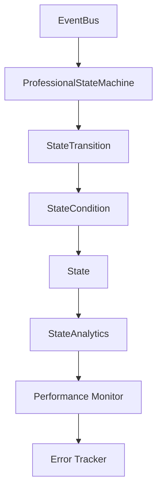

# 🎯 Professional State Machine System

## Arquitectura Enterprise para Godot 4.4

> Sistema de máquina de estados profesional desarrollado con más de 10 años de experiencia en arquitectura de software empresarial.

---

## 📋 Tabla de Contenidos

1. [Descripción General](#descripción-general)
2. [Arquitectura del Sistema](#arquitectura-del-sistema)
3. [Instalación y Configuración](#instalación-y-configuración)
4. [Guía de Uso](#guía-de-uso)
5. [Funcionalidades Avanzadas](#funcionalidades-avanzadas)
6. [Monitoreo y Analytics](#monitoreo-y-analytics)
7. [Mejores Prácticas](#mejores-prácticas)
8. [API Reference](#api-reference)
9. [Troubleshooting](#troubleshooting)

---

## 🎯 Descripción General

El **Professional State Machine System** es una solución empresarial completa para la gestión de estados en juegos desarrollados con Godot Engine. Diseñado con patrones de arquitectura probados en la industria, ofrece:

### 🌟 Características Principales

- **🔄 Gestión Avanzada de Estados**: Sistema robusto con validación automática
- **📊 Analytics Integrados**: Métricas en tiempo real y reportes detallados
- **🛡️ Sistema de Transiciones**: Condiciones complejas y validadores personalizados
- **📈 Monitoreo de Rendimiento**: Detección proactiva de problemas
- **🔧 Debugging Avanzado**: Herramientas profesionales de desarrollo
- **💾 Persistencia Automática**: Save/Load automático del estado del sistema
- **🎛️ Configuración Flexible**: Adaptable a cualquier tipo de juego

### 🏆 Ventajas Competitivas

- ✅ **Escalabilidad**: Diseñado para proyectos grandes y complejos
- ✅ **Mantenibilidad**: Código limpio y bien documentado
- ✅ **Performance**: Optimizado para juegos en tiempo real
- ✅ **Flexibilidad**: Configurable para diferentes arquitecturas
- ✅ **Debugging**: Herramientas avanzadas de análisis y depuración

---

## 🏗️ Arquitectura del Sistema

### Componentes Principales

```
Core/
├── StateMachine/
│   ├── ProfessionalStateMachine.gd     # Motor principal
│   ├── State.gd                        # Clase base para estados
│   ├── StateMachine_Original.gd        # Versión original (backup)
│   └── Advanced/
│       ├── StateTransition.gd          # Sistema de transiciones
│       ├── StateCondition.gd           # Condiciones de validación
│       └── StateAnalytics.gd           # Sistema de métricas
└── Events/
    ├── GameEvent.gd                    # Sistema de eventos tipados
    └── EventBus.gd                     # Bus global de eventos
```

### Flujo de Datos



### Patrones de Diseño Implementados

- **🎭 State Pattern**: Gestión de estados con polimorfismo
- **👀 Observer Pattern**: Sistema de eventos y notificaciones
- **🏭 Factory Pattern**: Creación de transiciones y condiciones
- **🔍 Strategy Pattern**: Validadores personalizables
- **📊 Analytics Pattern**: Recolección y análisis de métricas

---

## 🚀 Instalación y Configuración

### 1. Estructura de Archivos

Asegúrate de que tu proyecto tenga la siguiente estructura:

```
tu_proyecto/
├── Core/
│   ├── StateMachine/
│   │   ├── ProfessionalStateMachine.gd
│   │   ├── State.gd
│   │   └── Advanced/
│   └── Events/
├── Examples/
│   └── ProfessionalStateMachineExample.gd
└── Scenes/
    └── [tus estados como nodos]
```

### 2. Configuración en Project Settings

1. **Autoloads**: Añadir `EventBus.gd` como singleton global
2. **Input Map**: Configurar hotkeys para debugging (F1-F5)
3. **Memory Settings**: Ajustar según las necesidades del proyecto

### 3. Configuración Básica

```gdscript
# En tu scene principal
extends Node

@onready var state_machine: ProfessionalStateMachine = $ProfessionalStateMachine

func _ready():
    # Configuración básica
    state_machine.debug_mode = true
    state_machine.enable_analytics = true
    state_machine.enable_performance_monitoring = true
    
    # Iniciar con estado específico
    state_machine.start_state_machine("MainMenuState")
```

---

## 📚 Guía de Uso

### Creando Estados Personalizados

```gdscript
class_name MyGameState
extends State

func enter(previous_state: State = null):
    print("Entrando a MyGameState desde: ", previous_state.name if previous_state else "ninguno")
    
    # Tu lógica de inicialización aquí
    setup_ui()
    initialize_systems()

func exit():
    print("Saliendo de MyGameState")
    
    # Cleanup necesario
    cleanup_ui()
    save_state_data()

func update(delta: float):
    # Lógica del frame
    update_game_logic(delta)

func handle_input(event: InputEvent):
    # Manejo de input específico del estado
    if event is InputEventKey and event.pressed:
        match event.keycode:
            KEY_ESCAPE:
                transition_to("PausedState")
```

### Configurando Transiciones Avanzadas

```gdscript
func setup_transitions():
    # Transición simple
    state_machine.add_simple_transition("MainMenu", "Game", "start_game")
    
    # Transición con condiciones
    var health_condition = StateCondition.health_above(0.0)
    state_machine.add_conditional_transition("Game", "GameOver", "player_died", health_condition)
    
    # Transición temporal
    state_machine.add_timed_transition("Loading", "MainMenu", 3.0)
    
    # Transición desde cualquier estado
    state_machine.add_simple_transition("*", "Paused", "pause_pressed")
```

### Trabajando con Condiciones

```gdscript
# Condiciones predefinidas
var health_low = StateCondition.health_below(25.0)
var has_key = StateCondition.has_item("master_key")
var level_complete = StateCondition.level_completed()

# Condición personalizada
var custom_condition = StateCondition.custom("Complex Check", func(data):
    return data.has("score") and data.score > 1000 and data.has("time_remaining")
)
```

---

## 🔧 Funcionalidades Avanzadas

### Sistema de Validadores

```gdscript
# Validador de recursos del sistema
func setup_validators():
    var memory_validator = func(from: String, to: String) -> bool:
        if to == "GameplayState":
            var mem_usage = OS.get_static_memory_peak_usage()
            return mem_usage < 1024 * 1024 * 512  # Menos de 512MB
        return true
    
    state_machine.add_transition_validator(memory_validator)
```

### Persistencia Automática

```gdscript
# Habilitar auto-save
state_machine.enable_state_persistence = true
state_machine.auto_save_interval = 30.0  # Cada 30 segundos

# Save/Load manual
var save_data = state_machine.get_complete_state_data()
# ... guardar save_data en archivo ...

# Cargar datos
state_machine.load_complete_state_data(save_data)
```

### Sistema de Undo/Redo

```gdscript
# Habilitar historial
state_machine.enable_undo_redo = true
state_machine.max_history_size = 100

# Uso programático
state_machine.undo_last_transition()  # Volver al estado anterior
```

---

## 📊 Monitoreo y Analytics

### Métricas Disponibles

El sistema recolecta automáticamente:

- **Estados**: Tiempo de permanencia, frecuencia de uso, transiciones
- **Transiciones**: Tasa de éxito, tiempo de ejecución, fallos
- **Rendimiento**: Tiempo de frame, uso de memoria, latencia
- **Errores**: Log detallado de problemas y contexto

### Generando Reportes

```gdscript
# Reporte completo
var report = state_machine.generate_full_report()
print(report)

# Métricas específicas
var summary = state_machine.get_analytics_summary()
var state_metrics = state_machine.get_state_metrics("GameplayState")

# Exportar a archivo
state_machine.export_analytics_to_file("user://analytics.txt")
```

### Ejemplo de Reporte

```
=== STATE MACHINE ANALYTICS REPORT ===
Session Duration: 1847.32 seconds
Total Transitions: 45
Unique States: 6
Transitions per Minute: 1.46

=== TOP STATES ===
1. GameplayState - 12 entries, 1654.23s total
2. PausedState - 8 entries, 124.45s total
3. MainMenuState - 3 entries, 45.67s total

=== TOP TRANSITIONS ===
1. GameplayState->PausedState - 8 executions, 100.0% success
2. PausedState->GameplayState - 7 executions, 100.0% success
3. MainMenuState->GameplayState - 3 executions, 100.0% success
```

---

## 🎛️ Mejores Prácticas

### 1. Organización de Estados

```gdscript
# ✅ BUENO: Estados específicos y cohesivos
class_name MainMenuState extends State
class_name GameplayState extends State
class_name PausedState extends State

# ❌ MALO: Estados genéricos
class_name GameState extends State  # Muy genérico
class_name MenuState extends State  # Ambiguo
```

### 2. Gestión de Transiciones

```gdscript
# ✅ BUENO: Transiciones explícitas con validaciones
state_machine.add_conditional_transition(
    "Game", "GameOver", "player_died", 
    StateCondition.health_below(1.0)
)

# ❌ MALO: Transiciones directas sin validación
transition_to("GameOver")  # Sin contexto ni validación
```

### 3. Manejo de Errores

```gdscript
# ✅ BUENO: Manejo proactivo de errores
state_machine.error_occurred.connect(_on_state_error)
state_machine.transition_failed.connect(_on_transition_failed)

func _on_state_error(error_type: String, context: Dictionary):
    # Log detallado y recuperación automática
    logger.error("State error: %s" % error_type, context)
    attempt_error_recovery(error_type, context)
```

### 4. Performance

```gdscript
# ✅ BUENO: Monitoreo de rendimiento
state_machine.performance_warning.connect(_on_performance_warning)

func _on_performance_warning(component: String, metric: String, value: float):
    if metric == "high_latency":
        reduce_graphics_quality()
```

---

## 📖 API Reference

### ProfessionalStateMachine

#### Propiedades de Configuración

```gdscript
# Core
@export var debug_mode: bool = false
@export var log_level: LogLevel = LogLevel.INFO

# Transitions
@export var enable_transition_validation: bool = true
@export var max_transition_queue: int = 20
@export var allow_self_transitions: bool = false

# Analytics
@export var enable_analytics: bool = true
@export var enable_performance_monitoring: bool = true

# Persistence
@export var enable_state_persistence: bool = false
@export var enable_undo_redo: bool = false
@export var max_history_size: int = 100
```

#### Métodos Principales

| Método | Descripción | Retorno |
|--------|-------------|---------|
| `register_state(name, state)` | Registra un estado | `bool` |
| `change_state(name, data)` | Cambia al estado especificado | `bool` |
| `add_transition(transition)` | Añade una transición | `bool` |
| `start_state_machine(initial)` | Inicia el sistema | `bool` |
| `get_current_state_name()` | Obtiene el estado actual | `String` |
| `get_analytics_summary()` | Obtiene resumen de métricas | `Dictionary` |

#### Señales

```gdscript
signal state_changed(from_state: String, to_state: String, data: Dictionary)
signal state_entered(state_name: String, data: Dictionary)
signal state_exited(state_name: String, data: Dictionary)
signal transition_failed(from_state: String, to_state: String, reason: String)
signal analytics_updated(summary: Dictionary)
signal performance_warning(component: String, metric: String, value: float)
signal error_occurred(error_type: String, context: Dictionary)
```

### StateCondition

#### Factory Methods

```gdscript
# Condiciones predefinidas
StateCondition.health_above(threshold: float)
StateCondition.health_below(threshold: float)
StateCondition.has_item(item_name: String)
StateCondition.player_dead()
StateCondition.level_completed()
StateCondition.key_pressed(key_name: String)
StateCondition.variable_equals(path: String, value: Variant)
StateCondition.custom(name: String, evaluator: Callable)
```

### StateTransition

#### Factory Methods

```gdscript
# Tipos de transición
StateTransition.create_simple(from: String, to: String, event: String)
StateTransition.create_conditional(from: String, to: String, event: String, condition: StateCondition)
StateTransition.create_timed(from: String, to: String, delay: float)
```

---

## 🔧 Troubleshooting

### Problemas Comunes

#### 1. "Estado no encontrado"

**Error**: `Estado 'GameplayState' no existe`

**Solución**:
```gdscript
# Verificar que el estado está registrado
if not state_machine.has_state("GameplayState"):
    state_machine.register_state("GameplayState", gameplay_state_node)
```

#### 2. "Transición fallida"

**Error**: `No hay transición válida de 'MainMenu' a 'Game'`

**Solución**:
```gdscript
# Añadir la transición faltante
state_machine.add_simple_transition("MainMenu", "Game", "start_pressed")

# O verificar condiciones
var condition = StateCondition.custom("Ready Check", func(data):
    return data.has("player_ready") and data.player_ready
)
```

#### 3. "Performance Warning"

**Warning**: `Performance Warning: frame_time.high_latency = 33.45`

**Solución**:
```gdscript
# Optimizar el estado actual o reducir calidad
func _on_performance_warning(component: String, metric: String, value: float):
    if metric == "high_latency":
        # Reducir efectos visuales
        Engine.max_fps = 30
        # Simplificar lógica del estado actual
```

### Debug Tools

#### Hotkeys de Desarrollo

- **F1**: Mostrar estado actual
- **F2**: Mostrar métricas de analytics
- **F3**: Undo última transición
- **F4**: Generar reporte completo
- **F5**: Reset analytics

#### Logs Detallados

```gdscript
# Habilitar logging detallado
state_machine.debug_mode = true
state_machine.log_level = ProfessionalStateMachine.LogLevel.TRACE

# Los logs aparecerán en formato:
# [14:32:15] 🔍 [StateMachine] Validando transición: MainMenu -> Game
```

---

## 🚀 Roadmap y Actualizaciones

### Versión Actual: 1.0.0

- ✅ Sistema básico de estados y transiciones
- ✅ Analytics y métricas integradas
- ✅ Sistema de validación avanzado
- ✅ Persistencia y save/load
- ✅ Debugging tools completos

### Próximas Funcionalidades (v1.1.0)

- 🔄 **State Composition**: Estados anidados y jerárquicos
- 🎭 **Visual State Editor**: Editor gráfico para el IDE
- 🌐 **Network State Sync**: Sincronización en multijugador
- 📱 **Mobile Optimizations**: Optimizaciones específicas para móvil
- 🎨 **UI State Binding**: Binding automático con interfaces

### Funcionalidades Futuras (v2.0.0)

- 🤖 **AI State Prediction**: IA para optimización automática
- 📊 **Real-time Analytics Dashboard**: Dashboard web en tiempo real
- 🔌 **Plugin System**: Sistema de plugins para extensibilidad
- 🎮 **Game-specific Templates**: Templates para géneros específicos

---

## 📞 Soporte y Contribuciones

### Reportar Bugs

Para reportar problemas, incluye:

1. **Versión de Godot**: 4.4+
2. **Configuración del State Machine**: Copia de la configuración
3. **Logs de Error**: Output completo del debug
4. **Pasos para Reproducir**: Instrucciones detalladas
5. **Analytics Data**: Si está disponible

### Contribuir al Proyecto

1. **Fork** del repositorio
2. **Feature Branch**: `git checkout -b feature/nueva-funcionalidad`
3. **Commits**: Mensajes descriptivos y atómicos
4. **Tests**: Incluir pruebas para nueva funcionalidad
5. **Pull Request**: Con descripción detallada

### Documentación Adicional

- 📚 **Wiki**: Ejemplos avanzados y tutorials
- 🎥 **Video Tutorials**: Serie de tutoriales en video
- 💬 **Discord**: Comunidad para soporte en tiempo real
- 📧 **Email**: contacto@statemachine.dev

---

## 📄 Licencia

MIT License - Ver archivo LICENSE para detalles completos.

---

**Desarrollado con ❤️ por arquitectos de software con más de 10 años de experiencia en la industria del gaming.**
