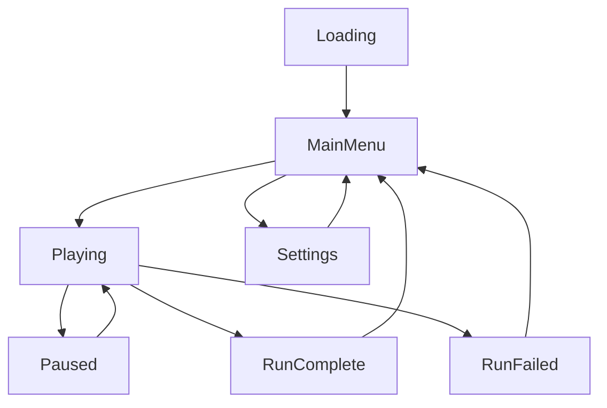

# 🎮 Topdown Game - Roguelike

Un juego roguelike top-down desarrollado en Godot 4.4 con arquitectura modular y sistemas profesionales de gestión de estado.

## 📋 Descripción

Este proyecto es un roguelike top-down que combina mecánicas clásicas del género con una arquitectura técnica robusta. El juego presenta generación procedural de mundos, sistema de runs, gestión avanzada de estado y herramientas de desarrollo integradas.

## ✨ Características Principales

### 🎯 Gameplay
- **Sistema de Runs**: Completar niveles consecutivos con estadísticas persistentes
- **Generación Procedural**: Mundos únicos generados con ruido FastNoiseLite
- **Múltiples Biomas**: 6 biomas diferentes (Grass, Desert, Forest, Mountains, Water, Snow)
- **Sistema de Chunks**: Carga dinámica de mundo para optimización
- **Estadísticas Avanzadas**: Tracking de tiempos, rachas y progreso

### 🏗️ Arquitectura Técnica
- **StateMachine Profesional**: Gestión robusta de estados del juego
- **Sistema de Managers**: Autoloads modulares para diferentes aspectos
- **Event Bus**: Comunicación desacoplada entre sistemas
- **Configuración Persistente**: Guardado automático de settings y progreso
- **Debug Console**: Herramientas de desarrollo integradas

### 🛠️ Sistemas Implementados
- **Audio Manager**: Gestión de música y efectos de sonido
- **Input Manager**: Manejo centralizado de controles
- **Config Manager**: Persistencia de configuración y datos
- **Debug Manager**: Herramientas de desarrollo y testing
- **World Generator**: Generación procedural con biomas y recursos

## 🚀 Instalación y Ejecución

### Requisitos
- Godot Engine 4.4+
- Sistema operativo: Windows, Linux, macOS

### Configuración Inicial
```bash
# Clonar el repositorio
git clone https://github.com/1SSeba/topdown-game.git
cd topdown-game

# Abrir en Godot
godot project.godot
```

### Ejecución Rápida
```bash
# Export debug (Linux)
./quick_export.sh

# Ejecutar directamente
godot --main-pack builds/debug/game_debug
```

## 🎮 Controles

| Acción | Tecla | Descripción |
|--------|-------|-------------|
| Movimiento | WASD / Flechas | Mover personaje |
| Pausa | P / ESC | Pausar/Reanudar juego |
| Debug Console | F3 | Abrir consola de desarrollo |
| Configuración | ESC (en menú) | Abrir settings |

## 🏗️ Arquitectura del Proyecto

### 📁 Estructura de Directorios

```
topdown-game/
├── 🎨 Assets/              # Recursos del juego
│   ├── Audio/              # Música y sonidos
│   ├── Characters/Player/  # Sprites del jugador
│   ├── Maps/Texture/       # Texturas de mapas
│   └── UI/                 # Elementos de interfaz
│
├── 🔄 Autoload/            # Sistemas globales (Singletons)
│   ├── AudioManager.gd     # Gestión de audio
│   ├── ConfigManager.gd    # Configuración persistente
│   ├── GameStateManager.gd # Estados del juego
│   ├── InputManager.gd     # Manejo de input
│   ├── GameManager.gd      # Lógica general
│   └── DebugManager.gd     # Herramientas de debug
│
├── 🏗️ Core/               # Sistemas centrales
│   ├── StateMachine/       # Máquina de estados
│   │   ├── StateMachine.gd # Motor principal
│   │   ├── State.gd        # Clase base
│   │   └── States/         # Estados específicos
│   └── Events/
│       └── EventBus.gd     # Sistema de eventos
│
├── 🎭 Scenes/              # Escenas del juego
│   ├── Main.tscn           # Escena principal
│   ├── Characters/Player/  # Jugador
│   ├── Menus/              # Menús del juego
│   ├── World/              # Sistema de mundo
│   └── Debug/              # Herramientas debug
│
└── 📚 docs/                # Documentación
    ├── PROJECT_STRUCTURE.md
    ├── STATEMACHINE_USAGE.md
    └── TROUBLESHOOTING.md
```

### 🔧 Managers y Sistemas

#### GameStateManager
- **Propósito**: Gestión central de estados del juego
- **Estados**: Loading, MainMenu, Playing, Paused, RunComplete, RunFailed
- **Características**: Tracking de runs, estadísticas persistentes, integración con StateMachine

#### ConfigManager
- **Propósito**: Gestión de configuración persistente
- **Funciones**: Audio, video, controles, progreso del juego
- **Persistencia**: Automática en `user://Data/config.cfg`

#### AudioManager
- **Propósito**: Gestión de audio del juego
- **Características**: Música de fondo, efectos de sonido, control de volumen
- **Integración**: Conectado con eventos de estado

#### InputManager
- **Propósito**: Manejo centralizado de input
- **Características**: Mapeo configurable, eventos de input, contextos
- **Flexibilidad**: Soporte para diferentes layouts de teclado

#### WorldGenerator
- **Propósito**: Generación procedural de mundos
- **Características**: Múltiples capas de ruido, biomas, recursos, cuevas
- **Optimización**: Sistema de chunks con carga dinámica

## 🎯 Estados del Juego



### Descripción de Estados

- **Loading**: Carga inicial de recursos y configuración
- **MainMenu**: Menú principal con opciones del juego
- **Playing**: Estado activo de gameplay durante una run
- **Paused**: Pausa temporal del juego (mantiene estado)
- **RunComplete**: Run completada exitosamente
- **RunFailed**: Run fallida (muerte del jugador)
- **Settings**: Configuración de audio, video y controles

## 🛠️ Herramientas de Desarrollo

### Debug Console (F3)
Consola interactiva con comandos de desarrollo:

```bash
# Comandos de estado
help                    # Mostrar ayuda
status                  # Estado de managers
gamestate              # Estado actual del juego

# Comandos de runs
start_run              # Iniciar nueva run
complete_run           # Completar run actual
fail_run               # Fallar run actual
reset_stats            # Resetear estadísticas

# Comandos de mundo
WorldTester.help()              # Ayuda de generación
WorldTester.test_basic_generation()  # Test básico
WorldTester.generate_test_world()    # Mundo de prueba
WorldTester.show_biome_info()        # Info de biomas
```

### Scripts de Desarrollo

```bash
# Verificar sintaxis
./scripts/check_syntax.sh

# Limpiar proyecto
./scripts/clean_project.sh

# Export rápido
./quick_export.sh

# Desarrollo con hot-reload
./dev.sh
```

## 🎨 Generación de Mundo

### Sistema de Biomas

| Bioma | Color | Características |
|-------|-------|----------------|
| Grass | Verde | Bioma base, balanceado |
| Desert | Amarillo | Seco, pocos recursos |
| Forest | Verde Oscuro | Denso, alta cobertura |
| Mountains | Gris/Marrón | Rocoso, elevado |
| Water | Azul | Acuático, navegable |
| Snow | Blanco | Frío, escaso |

### Configuración de Generación

```gdscript
# Parámetros principales
chunk_size = 64          # Tamaño de chunks
render_distance = 3      # Distancia de renderizado
noise_scale = 0.1        # Escala del ruido principal
cave_threshold = 0.3     # Umbral para cuevas
```

## 📊 Estadísticas y Progreso

### Tracking de Runs
- **Tiempo Total**: Duración de cada run
- **Mejor Tiempo**: Record personal persistente
- **Rachas**: Runs consecutivas completadas
- **Tasa de Éxito**: Porcentaje de runs completadas
- **Estadísticas Globales**: Total de runs, tiempo jugado

### Persistencia
- Guardado automático en `user://Data/config.cfg`
- Backup de seguridad en cambios importantes
- Migración automática entre versiones

## 🔧 Configuración Avanzada

### Audio
```gdscript
# Buses de audio configurables
master_volume: 0.8       # Volumen maestro
music_volume: 0.7        # Música de fondo
sfx_volume: 0.8          # Efectos de sonido
```

### Video
```gdscript
# Configuración de pantalla
screen_mode: 0           # 0=Windowed, 1=Fullscreen, 2=Borderless
vsync_enabled: true      # Sincronización vertical
target_fps: 60           # FPS objetivo
```

### Gameplay
```gdscript
# Opciones de gameplay
show_timer: true         # Mostrar timer de run
show_fps: false          # Mostrar contador FPS
particles_enabled: true  # Partículas activas
screen_shake: true       # Efecto de screen shake
```

## 🚨 Solución de Problemas

### Errores Comunes

**Error: "Cannot start with unknown state"**
```
Solución: Verificar registro de estados en GameStateManager
Archivo: GameStateManager.gd:_register_state_machine_states()
```

**Error: "TileSet not assigned"**
```
Solución: Crear TileSet manualmente en editor y asignar a TileMapLayer
Ubicación: Scenes/World/world.tscn
```

**Error: "AudioManager not ready"**
```
Solución: Verificar orden de autoloads en project.godot
Orden correcto: ConfigManager → InputManager → AudioManager
```

### Debug y Logging

```bash
# Verificar estado de managers
DebugManager.cmd_managers()

# Información completa del sistema
GameStateManager.debug_info()

# Test de acceso a managers
ManagerUtils.debug_test_manager_access()
```

## 🎯 Roadmap y Próximas Características

### Versión Actual (v1.0)
- ✅ Sistema base de StateMachine
- ✅ Managers fundamentales
- ✅ Generación procedural básica
- ✅ Sistema de runs y estadísticas

### Próximas Versiones
- 🔄 Sistema de inventario
- 🔄 Múltiples tipos de enemigos
- 🔄 Sistema de mejoras/upgrades
- 🔄 Múltiples armas y habilidades
- 🔄 Boss battles
- 🔄 Achievements system

## 📄 Licencia

Este proyecto está bajo la licencia especificada en el archivo [LICENSE](LICENSE).

## 🤝 Contribuciones

Las contribuciones son bienvenidas. Ver [CONTRIBUTING.md](CONTRIBUTING.md) para detalles sobre:
- Estilo de código
- Proceso de pull requests
- Reporte de bugs
- Sugerencias de características

## 📞 Contacto

- **Desarrollador**: 1SSeba
- **Repository**: [topdown-game](https://github.com/1SSeba/topdown-game)
- **Issues**: [GitHub Issues](https://github.com/1SSeba/topdown-game/issues)

---

*Última actualización: Agosto 2025*
*Desarrollado con ❤️ en Godot Engine*