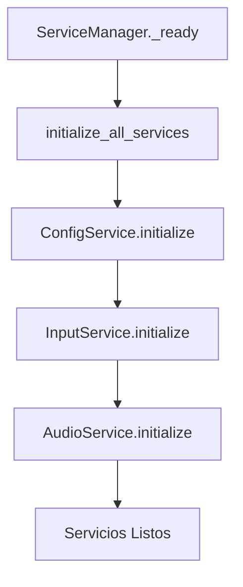

# ⚙️ Capa de Servicios y ServiceManager

## 📋 **Índice**
- [Visión General](#visión-general)
- [ServiceManager](#servicemanager)
- [Servicios Disponibles](#servicios-disponibles)
- [Ciclo de Vida de Servicios](#ciclo-de-vida-de-servicios)
- [Crear Nuevos Servicios](#crear-nuevos-servicios)
- [Mejores Prácticas](#mejores-prácticas)

---

## 🎯 **Visión General**

La **capa de servicios** proporciona funcionalidades centralizadas y reutilizables para todo el proyecto. Los servicios son singletons que manejan aspectos específicos del juego como configuración, audio, input, etc.

### **Características Principales**
- ✅ **Centralización**: Funcionalidades globales en un lugar
- ✅ **Singleton**: Una instancia por servicio en toda la aplicación
- ✅ **Lazy Loading**: Servicios se cargan cuando se necesitan
- ✅ **Lifecycle Management**: Inicialización y limpieza automática
- ✅ **Dependency Injection**: Servicios disponibles globalmente

---

## 🎯 **ServiceManager**

El `ServiceManager` es el coordinador central que gestiona todos los servicios del proyecto.

### **Ubicación y Configuración**
```gdscript
# /src/core/ServiceManager.gd
extends Node

# Autoload configurado en project.godot
# Nombre: ServiceManager
# Ruta: res://src/core/ServiceManager.gd
```

### **API Principal**
```gdscript
# Obtener servicios
ServiceManager.get_config_service()
ServiceManager.get_audio_service()
ServiceManager.get_input_service()

# Verificar disponibilidad
ServiceManager.is_service_ready("ConfigService")

# Lifecycle
ServiceManager.initialize_all_services()
ServiceManager.shutdown_all_services()
```

### **Implementación**
```gdscript
class_name ServiceManager
extends Node

# Referencias a servicios
var _config_service: ConfigService
var _audio_service: AudioService
var _input_service: InputService

# Estado del ServiceManager
var _is_initialized: bool = false

func _ready() -> void:
    print("ServiceManager: Starting service initialization...")
    initialize_all_services()

func initialize_all_services() -> void:
    if _is_initialized:
        return
    
    # Inicializar servicios en orden de dependencia
    _config_service = ConfigService.new()
    add_child(_config_service)
    _config_service.initialize()
    
    _input_service = InputService.new()
    add_child(_input_service)
    _input_service.initialize()
    
    _audio_service = AudioService.new()
    add_child(_audio_service)
    _audio_service.initialize()
    
    _is_initialized = true
    print("ServiceManager: All services initialized successfully")

# Getters para servicios
func get_config_service() -> ConfigService:
    return _config_service

func get_audio_service() -> AudioService:
    return _audio_service

func get_input_service() -> InputService:
    return _input_service
```

---

## 🛠️ **Servicios Disponibles**

### **ConfigService**
Manejo de configuración persistente del juego.

```gdscript
# Ubicación: /src/core/services/ConfigService.gd
class_name ConfigService
extends GameService

# Configuración del juego
var master_volume: float = 1.0
var music_volume: float = 0.8
var sfx_volume: float = 1.0
var fullscreen: bool = false

func initialize() -> void:
    load_config()
    print("ConfigService: Config file loaded")

func save_config() -> void:
    var config = ConfigFile.new()
    config.set_value("audio", "master_volume", master_volume)
    config.set_value("audio", "music_volume", music_volume)
    config.set_value("audio", "sfx_volume", sfx_volume)
    config.set_value("video", "fullscreen", fullscreen)
    config.save("user://config.cfg")

func load_config() -> void:
    var config = ConfigFile.new()
    if config.load("user://config.cfg") == OK:
        master_volume = config.get_value("audio", "master_volume", 1.0)
        music_volume = config.get_value("audio", "music_volume", 0.8)
        sfx_volume = config.get_value("audio", "sfx_volume", 1.0)
        fullscreen = config.get_value("video", "fullscreen", false)

# API pública
func set_master_volume(volume: float) -> void:
    master_volume = clamp(volume, 0.0, 1.0)
    save_config()
    EventBus.config_changed.emit("master_volume", master_volume)

func get_master_volume() -> float:
    return master_volume
```

### **AudioService**
Gestión centralizada de audio con pools de AudioStreamPlayer.

```gdscript
# Ubicación: /src/core/services/AudioService.gd
class_name AudioService
extends GameService

# Pool de reproductores de audio
var _sfx_players: Array[AudioStreamPlayer] = []
var _music_player: AudioStreamPlayer
var _current_music: AudioStream

func initialize() -> void:
    # Crear pool de reproductores SFX
    for i in 5:
        var player = AudioStreamPlayer.new()
        add_child(player)
        _sfx_players.append(player)
    
    # Crear reproductor de música
    _music_player = AudioStreamPlayer.new()
    add_child(_music_player)
    _music_player.bus = "Music"
    
    print("AudioService: Audio systems initialized")

func play_sfx(sound: AudioStream, volume: float = 1.0) -> void:
    var player = _get_available_sfx_player()
    if player:
        player.stream = sound
        player.volume_db = linear_to_db(volume)
        player.play()
        EventBus.sfx_played.emit(sound)

func play_music(music: AudioStream, fade_in: bool = true) -> void:
    if _current_music == music:
        return
    
    _current_music = music
    _music_player.stream = music
    
    if fade_in:
        _fade_in_music()
    else:
        _music_player.play()
    
    EventBus.music_changed.emit(music)

func _get_available_sfx_player() -> AudioStreamPlayer:
    for player in _sfx_players:
        if not player.playing:
            return player
    return null
```

### **InputService**
Manejo avanzado de input con buffer y contextos.

```gdscript
# Ubicación: /src/core/services/InputService.gd
class_name InputService
extends GameService

# Sistema de buffering de input
var _input_buffer: Array = []
const BUFFER_SIZE: int = 10
const BUFFER_TIME: float = 0.1

# Contextos de input
enum InputContext { MENU, GAMEPLAY, PAUSED }
var current_context: InputContext = InputContext.MENU

func initialize() -> void:
    # Configurar timer para buffer
    var timer = Timer.new()
    timer.wait_time = BUFFER_TIME
    timer.timeout.connect(_clear_old_inputs)
    add_child(timer)
    timer.start()
    
    print("InputService: Input buffering initialized")

func _input(event: InputEvent) -> void:
    # Añadir input al buffer
    _input_buffer.append({
        "event": event,
        "time": Time.get_time_dict_from_system(),
        "context": current_context
    })
    
    # Mantener buffer size
    if _input_buffer.size() > BUFFER_SIZE:
        _input_buffer.pop_front()
    
    # Procesar input según contexto
    match current_context:
        InputContext.MENU:
            _handle_menu_input(event)
        InputContext.GAMEPLAY:
            _handle_gameplay_input(event)
        InputContext.PAUSED:
            _handle_paused_input(event)

func set_input_context(context: InputContext) -> void:
    current_context = context
    EventBus.input_context_changed.emit(context)

func _handle_gameplay_input(event: InputEvent) -> void:
    if event.is_action_pressed("move_left"):
        EventBus.player_input.emit("move_left")
    elif event.is_action_pressed("move_right"):
        EventBus.player_input.emit("move_right")
    # ... más inputs
```

---

## 🔄 **Ciclo de Vida de Servicios**

### **1. Inicialización**


### **2. Operación**
```gdscript
# Los servicios procesan eventos y peticiones
func _process(_delta):
    # AudioService actualiza fades
    # InputService procesa buffer
    # ConfigService mantiene sincronización
```

### **3. Limpieza**
```gdscript
func shutdown_all_services() -> void:
    if _audio_service:
        _audio_service.cleanup()
    if _input_service:
        _input_service.cleanup()
    if _config_service:
        _config_service.cleanup()
    
    _is_initialized = false
```

---

## ➕ **Crear Nuevos Servicios**

### **1. Heredar de GameService**
```gdscript
# /src/core/services/MyCustomService.gd
class_name MyCustomService
extends GameService

var my_data: Dictionary = {}

func initialize() -> void:
    # Configuración inicial
    setup_my_service()
    print("MyCustomService: Initialized")

func cleanup() -> void:
    # Limpieza de recursos
    my_data.clear()

# API pública del servicio
func do_something() -> void:
    # Lógica del servicio
    pass
```

### **2. Registrar en ServiceManager**
```gdscript
# En ServiceManager.gd
var _my_custom_service: MyCustomService

func initialize_all_services() -> void:
    # ... otros servicios ...
    
    _my_custom_service = MyCustomService.new()
    add_child(_my_custom_service)
    _my_custom_service.initialize()

func get_my_custom_service() -> MyCustomService:
    return _my_custom_service
```

### **3. Usar el Servicio**
```gdscript
# Desde cualquier parte del proyecto
var my_service = ServiceManager.get_my_custom_service()
my_service.do_something()
```

---

## 🎯 **Mejores Prácticas**

### **1. Servicios Stateless cuando sea Posible**
```gdscript
# ✅ Bueno: Funciones sin estado
func play_sound(sound: AudioStream):
    # Lógica sin estado persistente
    pass

# ❌ Evitar: Estado complejo innecesario
var complex_state_dict: Dictionary = {}
```

### **2. API Clara y Consistente**
```gdscript
# ✅ Bueno: API clara
func set_master_volume(volume: float) -> void
func get_master_volume() -> float
func save_config() -> void
func load_config() -> void

# ❌ Malo: API inconsistente
func volume(vol: float) -> void
func get_vol() -> float
func saveConfig() -> void
```

### **3. Error Handling**
```gdscript
# ✅ Bueno: Manejo de errores
func load_config() -> bool:
    var config = ConfigFile.new()
    var error = config.load("user://config.cfg")
    if error != OK:
        print("Warning: Could not load config, using defaults")
        return false
    return true
```

### **4. Eventos para Comunicación**
```gdscript
# ✅ Bueno: Emitir eventos para cambios
func set_master_volume(volume: float) -> void:
    master_volume = volume
    EventBus.volume_changed.emit(volume)

# ❌ Malo: Cambios silenciosos
master_volume = volume  # Nadie se entera del cambio
```

---

## 📊 **Ventajas de los Servicios**

### **Centralización**
- Una ubicación para cada funcionalidad global
- Fácil mantenimiento y debugging
- Configuración consistente

### **Reutilización**
- Los servicios pueden usarse desde cualquier parte
- No necesidad de pasar referencias
- API consistente en todo el proyecto

### **Testeo**
- Servicios independientes son fáciles de probar
- Mocking sencillo para tests unitarios
- Lifecycle controlado para tests

### **Performance**
- Lazy loading de servicios
- Pool de recursos (AudioService)
- Configuración optimizada

---

**⚙️ ¡Servicios centralizados para funcionalidad global!**

*Última actualización: Septiembre 4, 2025*
